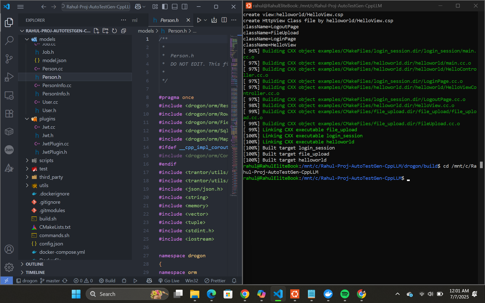
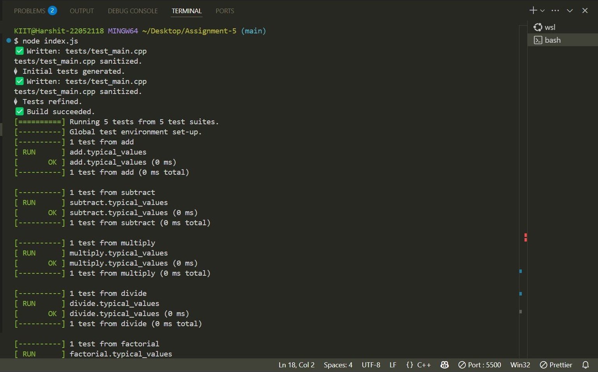

# 🧪 C++ Unit Test Generator (LLM-Powered)

This project is a **C++ Unit Test Generator** that automatically creates, refines, and improves unit tests for C++ applications using a Large Language Model (LLM).  
It takes a C++ project as input, generates unit tests, fixes issues, and improves test coverage automatically.

It is useful for automating the testing process of C++ projects using AI-powered models like **LLaMA** or other GitHub-hosted models.

---

## 📂 Project Folder Structure

```
llm-cpp-unit-test-generator/
│
├── another_source/       → External libraries or dependencies  
├── backup-repo/          → Backup repository (for safety)  
├── controllers/          → LLM-generated unit tests for controllers  
├── models/               → Core data models for the OrgChart API  
├── screenshot/           → Project screenshots (for documentation)  
├── scripts/              → Database setup and seed scripts  
├── utils/                → Utility functions for unit tests  
│
├── CMakeLists.txt        → CMake build configuration  
├── config.json           → Configuration file for project setup  
├── main.cc               → Main entry point script for the project  
├── README.md             → This project documentation file  
```

---

## 🛠️ Tools & Dependencies

You'll need the following tools installed on your system:
- ✅ **C++ Compiler** (Example: `g++`)
- ✅ **CMake** (To build the project)
- ✅ **Google Test (GTest)** Framework  
- ✅ **GNU Coverage Tools** (`gcov`, `lcov`) for test coverage reports
- ✅ A working **LLM** (like LLaMA or similar, local or hosted)
- ✅ Python (optional, for LLM interaction scripts if needed)
- ✅ Docker (Optional, for isolated builds and tests)

---

## 🚀 How to Build & Run This Project

Here are the complete step-by-step instructions:

### 1. **Clone the Repository**
```bash
git clone https://github.com/codexrahulKIIT/llm-cpp-unit-test-generator.git
cd llm-cpp-unit-test-generator
```

---

### 2. **Generate Unit Tests Automatically**
- Prepare your C++ source code inside the `models/` or `controllers/` folders.
- Prepare a **YAML instruction file** with strict prompts.
- Use your LLM (like LLaMA or others) to:
  - Read the C++ code
  - Generate initial unit tests automatically into the `controllers/` folder.
  - Refine the tests based on additional prompts.

---

### 3. **Build the Project (With CMake)**
```bash
mkdir build
cd build
cmake ..
make -j$(nproc)
```

---

### 4. **Run the Tests**
```bash
./your_test_binary_name_here  # Replace with your compiled test binary name
```

---

### 5. **Collect Test Coverage**
Use GNU Coverage Tools to analyze test coverage:
```bash
gcov your_source_files.cpp
lcov --capture --directory . --output-file coverage.info
```

---

### 6. **Refine Tests If Needed**
If tests fail or coverage is low:
- Send the build logs, error output, and test files back to your LLM.
- Let the LLM improve the tests further.
- Repeat build & test steps as needed.

---

## 🖼️ Screenshots (Example)

- **Build Target:**  


- **Successful Build:**  



---

## 📋 What I Did in This Project 

In this project, I created a tool that automatically makes unit tests for C++ programs using AI (LLM models).  
The tool reads C++ files, creates tests, and even fixes them automatically if something is wrong.

Here’s what it does:
- Makes tests for C++ projects
- Improves and refines the tests by removing duplicate tests and adding libraries
- Builds the project and ensures it works with the tests
- Calculates test coverage and suggests improvements

This helps reduce manual work and makes testing faster and smarter.

---

## 📝 Notes for Customization & Further Use

- You can switch to any LLM model by changing your prompts and YAML instructions.
- You can reuse this tool with any C++ project by replacing the files inside the `models/` or `controllers/` folders.
- You may also containerize the project using Docker for simpler builds on any machine.

---

## 🙋‍♂️ Author

- **Name:** Rahul Kumar
- **GitHub:** [@codexrahulKIIT](https://github.com/codexrahulKIIT)

---

✅ This project simplifies C++ unit test generation using AI-powered tools.
